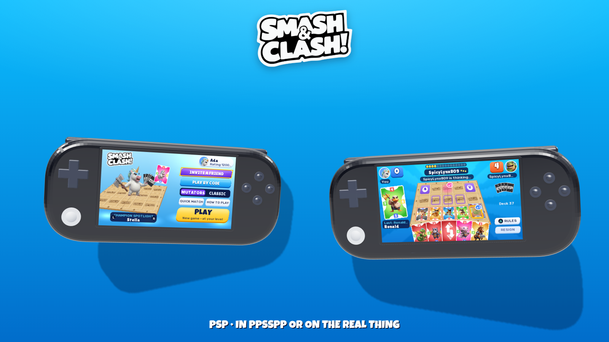
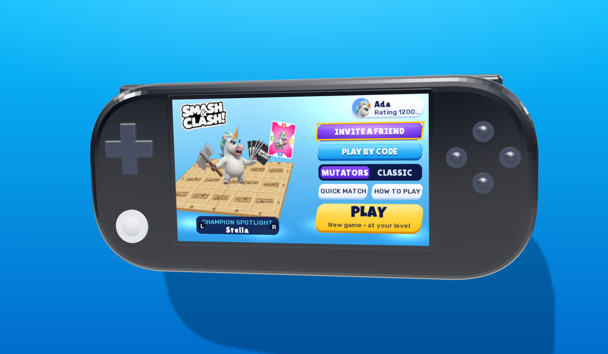
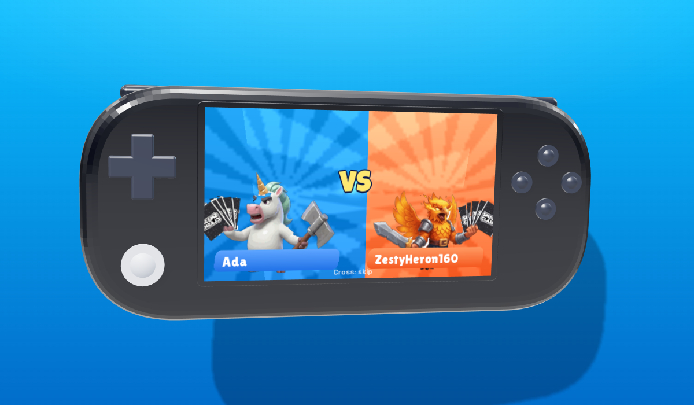
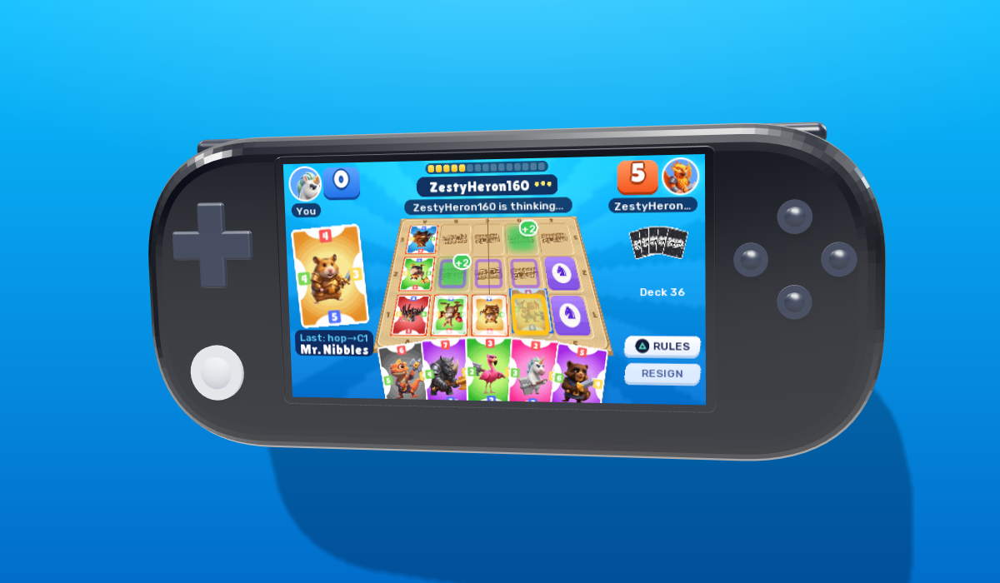
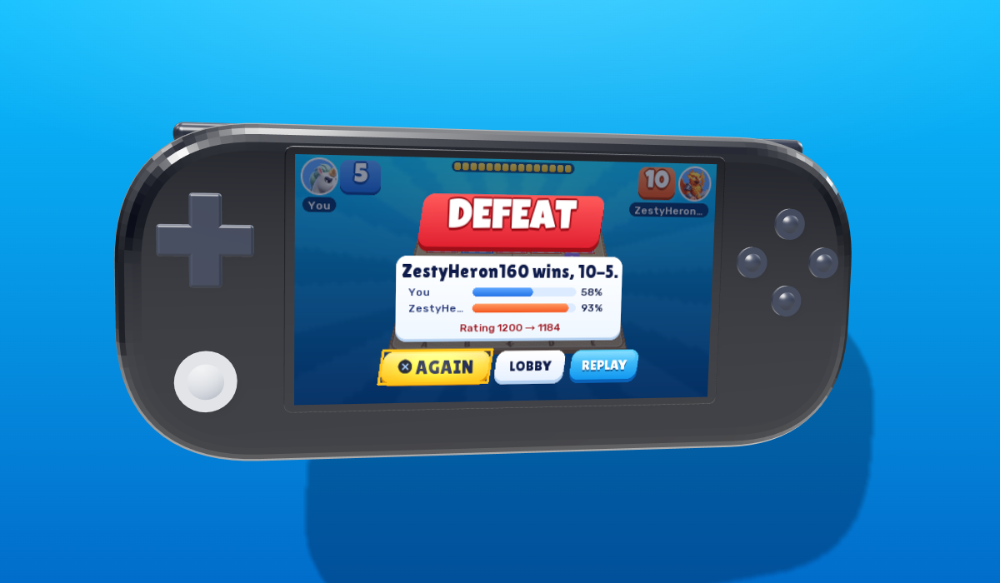
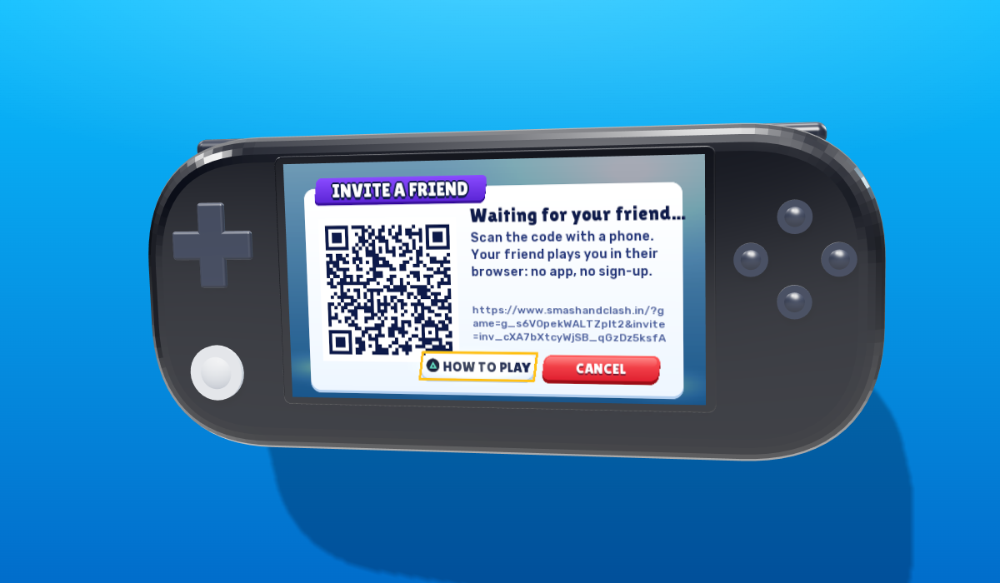
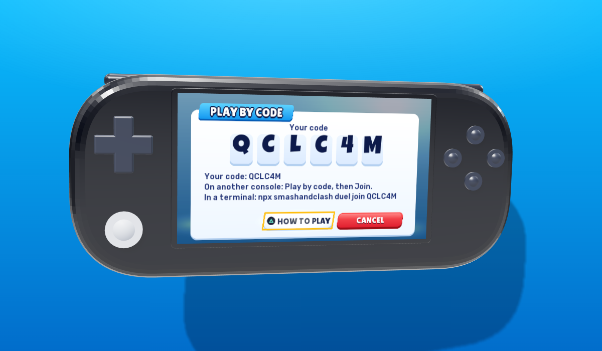
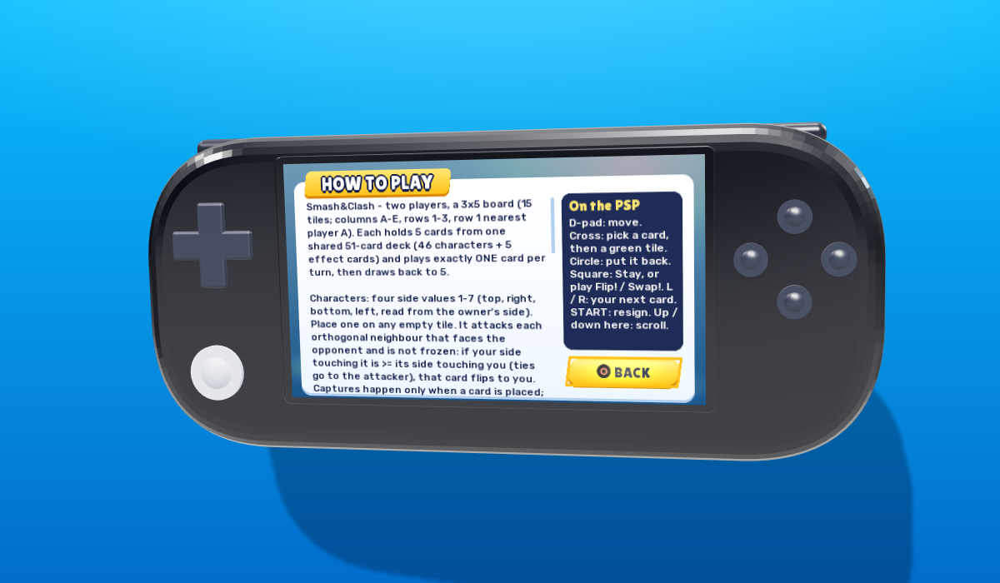
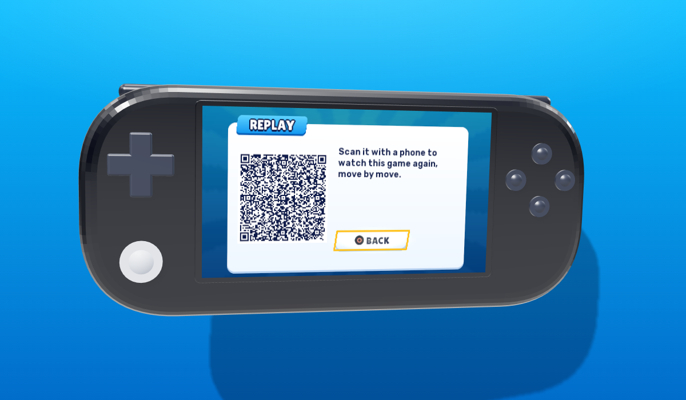

<div align="center">

# Smash&Clash on the PSP

**Smash&Clash, playable online on the PlayStation Portable: in [PPSSPP](https://www.ppsspp.org) on your phone, tablet or computer, and on a real PSP. A complete client built on the official [Smash&Clash SDK](https://docs.smashandclash.in) API, drawn by the PSP's own GPU.**

Real games against real people and the house opponent, on smashandclash.in's servers: the wooden board with the engraved logo, the champions, the VS intro and the Game Review, the way [smashandclash.in](https://www.smashandclash.in) draws them.



**[⬇ Download the PSP game (v1.0.0)](https://github.com/smashandclash/ppsspp/releases/latest)**

**Build your own client today: [docs.smashandclash.in](https://docs.smashandclash.in)**

</div>

---

The Smash&Clash SDK lets you build your own Smash&Clash client on anything. This repo is the proof on a 2004 handheld: a 333 MHz MIPS with 32 MB of RAM that speaks TLS to the game's API on its own and draws the board in 3D.

Looking for the DS and the Game Boy Advance? They have their own repo, with Delta skins: **[smashandclash/delta](https://github.com/smashandclash/delta)**.

## Contents

- [What's in here](#whats-in-here)
- [Play it in a minute](#play-it-in-a-minute)
- [Screenshots](#screenshots)
- [How to play](#how-to-play)
- [The sound](#the-sound)
- [How it works](#how-it-works)
- [The SDK, call by call](#the-sdk-call-by-call)
- [Build it yourself](#build-it-yourself)
- [Tests: real games, headless](#tests-real-games-headless)
- [Build your own client](#build-your-own-client)
- [Troubleshooting](#troubleshooting)
- [Links](#links)

## What's in here

| Path | What it is |
| --- | --- |
| [`psp/`](psp) | **The PSP game** (C, [PSPDEV](https://pspdev.github.io)). The network on its own thread; the screens drawn with the GU, the PSP's GPU. |
| [`psp/source/view3d.c`](psp/source/view3d.c) | The screens: the lobby with the champion spotlight, the perspective board, cards that fly and turn, the VS intro, the result slab. |
| [`psp/audio/`](psp/audio) | **The PSP's own soundtrack and effects** ([`tools/audio/`](tools/audio) made them). |
| [`core/`](core) | The shared C core (the same one the DS and GBA games use): an HTTPS keep-alive client on mbedTLS, the SDK's calls in C, the client's state machine and D-pad navigation. |
| [`tools/`](tools) | Builds the art from the real game: the 51-card deck, the champions, the wooden board with the engraved Smash&Clash logo, the fonts, the XMB icon; and the TLS root certificates. |
| [`tests/`](tests) | A headless PPSSPP test that plays a full online game and visits every screen. |
| [`docs/`](docs) | [How it works](docs/how-it-works.md) and [build your own client](docs/build-your-own-client.md). |

## Play it in a minute

You need an internet connection; the game runs on smashandclash.in's servers.

**In PPSSPP** (Android, iOS, Windows, macOS, Linux):

1. Download **`smashandclash-psp.zip`** from the [latest release](https://github.com/smashandclash/ppsspp/releases/latest) and unzip it. It holds `PSP/GAME/SmashAndClash/EBOOT.PBP`.
2. In PPSSPP, turn on **Settings → Networking → Enable networking/WLAN**.
3. Open `EBOOT.PBP` (or the `SmashAndClash` folder) in PPSSPP's game browser, and play.

**On a PSP** (custom firmware, to run homebrew): copy the `PSP` folder to the root of the Memory Stick, set up a Wi-Fi connection in **Settings → Network Settings → Infrastructure Mode** (the game uses the first one), and start **Smash&Clash** from the Game menu.

Your record (rating, rules, champion, the game in progress) is kept in `record.txt` next to the EBOOT, so switching off mid-game picks it up where you left it.

## Screenshots

| | |
| :---: | :---: |
|  |  |
| **The lobby.** Your champion stands on the wooden board (L / R picks another); New game plays an opponent at your level. | **The VS intro**, before every game: your champion against theirs. |
|  |  |
| **A game.** The board in perspective with the Smash&Clash logo engraved in each tile, your hand fanned below, the card you are looking at on the left. | **Game over.** The result slab, both players' Game Review accuracy and your new rating. |
|  |  |
| **Invite a friend.** A phone scans the code and plays you in its browser: no app, no sign-up. | **Play by code.** Another PSP, a DS, a GBA or a terminal joins with the 6-letter code. |
|  |  |
| **How to play**, from the server, with the PSP's controls beside it. | **The replay**: scan it to watch the game again, move by move. |

## How to play

Smash&Clash is a two-player game on a 3 × 5 board. Each player holds 5 cards and plays one per turn.

- **Characters** have four side values (1–7). Place one on an empty tile and it attacks each neighbour that faces the other player: if your touching side is at least theirs, that card turns to you. When all 15 tiles are full, whoever has more cards facing them wins.
- **Effects** (Boulder!, Flip!, Freeze!, Recruit!, Swap!) play when they can do something.
- **Mutators** (the default rules) add chess tiles (hop like a knight, bishop, rook or queen), power tiles (+1/+2 for a colour) and overrun zones. **Classic** turns them off.

You are always blue and the other side orange, whichever seat you hold. **Quick match** pairs you with whoever is online; **Invite a friend** shows a QR code; **Play by code** hosts or joins a duel code, so a PSP, a DS, a GBA and a terminal (`npx smashandclash duel join CODE`) can all play each other.

| | |
| --- | --- |
| D-pad or analog stick | move |
| **Cross** | pick a card, then a green tile |
| **Circle** | put the card back / back |
| **Square** | the contextual button: Stay on a hop, play Flip! or Swap! |
| **Triangle** | how to play |
| **L** / **R** | your next playable card (in the lobby: your champion) |
| **SELECT** | the replay QR, after a game |
| **START** | resign (press twice); in the lobby: sound on or off |

## The sound

The PSP has its own original soundtrack and effects, made with [ElevenLabs](https://elevenlabs.io): late-night arcade synth (shimmering pads, analog bass, breakbeats), with a lobby theme, a game theme, a win and a lose jingle, and eight effects (the cursor, picking, backing out, a card landing, a capture, your turn, a "not allowed" and the game starting). The DS and the GBA each have a sound of their own: handheld pop and pocket chiptune ([smashandclash/delta](https://github.com/smashandclash/delta)).

A mixer on its own thread ([`psp/source/sound.c`](psp/source/sound.c)) plays the theme and up to four effects at once: 16-bit PCM at 22050 Hz, out at 44100 Hz stereo through one hardware channel. The themes loop seamlessly: [`tools/audio/make_audio.py`](tools/audio/make_audio.py) cuts each one on the bar, a whole number of bars long, lined up by cross-correlation and crossfaded at the seam. What plays when is shared with the DS and GBA ([`core/snc_sound.c`](core/snc_sound.c)). **START** in the lobby turns the sound off (and on again); the game remembers.

## How it works

The PSP game is written in C on a core it shares with the DS and GBA games:

```
 psp/source/main.c ──▶ snc_client ──▶ snc_api ──▶ snc_http (mbedTLS 2.28) ──▶ smashandclash.in
 (input, frames)       (state, jobs)  (SDK calls)
        └──▶ view3d.c ──▶ gx.c (the GU: textured quads in perspective, a CLUT texture atlas)
```

1. **`snc_api`** is the SDK's calls in C, named the way `@smashandclash/sdk` names them (`games.startHouse`, `game.play`, `game.waitForTurn`, …), reading the API's JSON into a `snc_game`: the board in your frame, your hand with its printed sides, the special tiles and `legalMoves`.
2. **`snc_client`** is the whole client minus the drawing, with **one network job at a time**. The network runs on a lower-priority thread, so the 60 fps GPU loop never waits: an action queues a job and returns, and a long wait for the other player is cut short when you act.
3. **`view3d.c`** draws every frame with the GU: the board is a textured quad in perspective (the wood and the engraved logo are generated from the real logo at build time), cards are paletted textures, and the slabs and type are Arena Pop, like the web edition. Its touch-free targets go through the shared D-pad navigation (`core/snc_ui.c`).
4. **TLS**: mbedTLS 2.28 from PSPDEV, seeded from the PSP's own entropy (it has no `/dev/urandom`), Let's Encrypt roots built in, and the system resolver with a fallback to 1.1.1.1 over UDP.

The parts, drawing either seat and the gotchas are in **[docs/how-it-works.md](docs/how-it-works.md)**.

## The SDK, call by call

Every feature is one SDK call. The C core makes it over HTTPS, under the SDK's own names:

| In the game | SDK (`@smashandclash/sdk`) | C core |
| --- | --- | --- |
| **New game** (an opponent at your level) | `sc.games.startHouse({ name, as: 'person', ruleset, strength })` | `snc_start_house` |
| **Quick match** | `sc.games.quickMatch({ name, as: 'person', opponent: 'any' })` | `snc_quick_match` |
| **Invite a friend** (the QR code) | `sc.games.createDuel({ name, as: 'person', opponent: 'person' })` → `game.inviteUrl` | `snc_create_invite` |
| **Play by code: Host** | `sc.games.createDuel({ name, as: 'person' })` → `game.code` | `snc_host_code` |
| **Play by code: Join** | `sc.games.joinDuel(code, { name, as: 'person' })` | `snc_join_code` |
| Play a card | `game.play('Pengu@C2')` | `snc_play` |
| Wait for the other side | `game.waitForTurn(20)` (a long poll) | `snc_wait` |
| **Resign / Cancel** | `game.resign()` | `snc_resign` |
| Their hand once the deck is out | `game.sync({ since })` → `state.opponentHand` | `snc_opponent_hand` |
| **How to play** | `sc.rules()` | `snc_rules` |
| Game over: accuracy | `sc.games.review(id)` | `snc_review` |
| Switch off mid-game | `sc.games.resume(id, playerToken)` | `snc_refresh` |
| Replay QR | `game.replayUrl` | `snc_game.replay_url` |

```c
// core/snc_api.c: one SDK call, in C
int snc_play(snc_api *a, snc_game *g, const char *move) {
	char path[96], body[128], qm[80];
	snprintf(path, sizeof path, "/api/v1/games/%s/moves", g->id);
	sj_quote(qm, sizeof qm, move);
	snprintf(body, sizeof body, "{\"move\":%s}", qm);
	return game_call(a, g, "game.play", "POST", path, body, 40000);  // against the house, the reply comes with it
}
```

The full API, including hosting matches between two people, spectating and replays, is at **[docs.smashandclash.in](https://docs.smashandclash.in)**.

## Build it yourself

The build runs on Linux (or WSL) with [PSPDEV](https://pspdev.github.io) on the `PATH` (it bundles mbedTLS) and Python 3 with `pip install pillow fonttools`. The art is made from the real game the first time you build: the deck and its art from the API, the logo and champions from smashandclash.in, the fonts from Google Fonts (cached in `tools/cache/`).

```bash
make -C psp            # -> psp/EBOOT.PBP
```

`tools/make_certs.mjs` refreshes the built-in root certificates (`core/snc_certs.h`) from `tools/roots.pem`. The sound is committed, ready to build (`psp/audio/`); [`tools/audio/gen.mjs`](tools/audio/gen.mjs) holds the prompts it was made from (it needs an ElevenLabs API key to make new takes) and [`tools/audio/make_audio.py`](tools/audio/make_audio.py) encodes them (numpy and ffmpeg).

## Tests: real games, headless

The test boots the EBOOT in PPSSPP's libretro core with no window (EGL on llvmpipe), plays a full online game against the house opponent by pressing buttons like a person, then visits the replay QR, the rules, Play by code, a hosted duel, an invite and the quick-match queue, saving screenshots along the way. It reads what is on screen from a tagged line the game keeps in RAM.

```bash
pip install libretro.py pillow moderngl PyOpenGL
export PYOPENGL_PLATFORM=egl
python3 tests/psp_play.py psp/EBOOT.PBP build/psp-test --scenario screens
```

It needs `ppsspp_libretro.so` (`PPSSPP_CORE`) and PPSSPP's system files; see the top of the script.

## Build your own client

A PSP is one surface. The same calls work for a Discord bot, a terminal, a game engine, a smartwatch or something nobody has thought of yet. **[docs/build-your-own-client.md](docs/build-your-own-client.md)** is the checklist: the state you get, move names, drawing the board from either seat, effects, hops and overruns, waiting, errors and rate limits, and fair play. Start at **[docs.smashandclash.in](https://docs.smashandclash.in)**.

## Troubleshooting

- **"No network connection"** in PPSSPP: turn on **Settings → Networking → Enable networking/WLAN** and start the game again.
- **On a PSP**: the game uses the first connection in Network Settings; a PSP joins WPA networks with 2.4 GHz Wi-Fi only.
- **"The secure connection could not start"**: the network blocks HTTPS, or the clock is far off. The game skips certificate dates when the clock reads before 2026, so check the network first.
- **Play a friend on the same Wi-Fi.** Play by code works across any networks: both sides talk to smashandclash.in, never to each other.

## Links

- **Docs and API: [docs.smashandclash.in](https://docs.smashandclash.in)**
- Play: [smashandclash.in](https://www.smashandclash.in)
- SDK on npm: [`@smashandclash/sdk`](https://www.npmjs.com/package/@smashandclash/sdk)
- The DS and GBA games: [smashandclash/delta](https://github.com/smashandclash/delta)
- On a tldraw board: [smashandclash/tldraw](https://github.com/smashandclash/tldraw)
- OpenAPI 3.1: [smashandclash.in/openapi.json](https://www.smashandclash.in/openapi.json)
- The terminal client: `npx smashandclash`

## License

The code in this repo (the PSP game, the core, tools and tests) is MIT licensed; see [LICENSE](LICENSE). It includes [jsmn](https://github.com/zserge/jsmn) (MIT) and [QR Code generator](https://www.nayuki.io/page/qr-code-generator-library) by Project Nayuki (MIT). The fonts the build downloads are under the SIL Open Font License (Lilita One, Rubik, Noto) and Apache 2.0 (Luckiest Guy). The Smash&Clash game, its rules, characters, artwork, audio and other assets are proprietary and are not licensed here: the build fetches the card art, champions and logo from smashandclash.in, and the released EBOOT carries them by permission of Smash&Clash.
